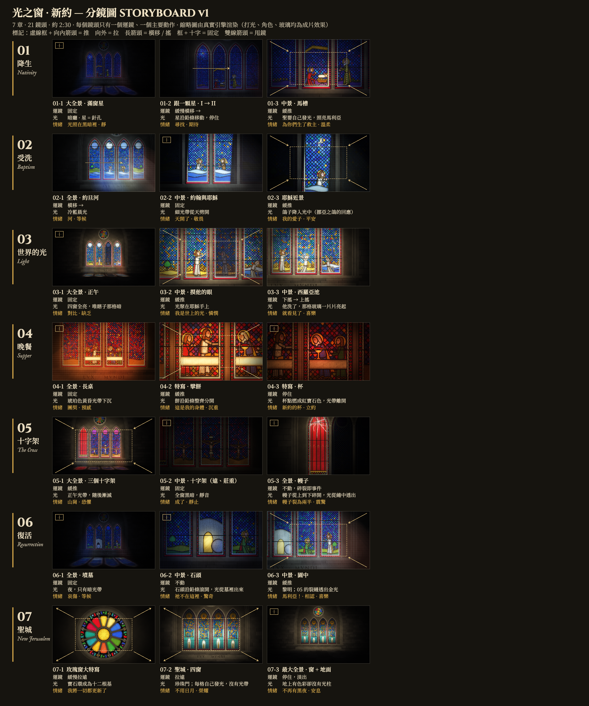

# 光之窗 · 新約 · The New Covenant: Treatment

## 1. Brief
- Sequel to 《光之窗》 (the Old Testament, `../bible-story`), whose end card promised 「下一扇窗 · 新約」.
  The same dark stone hall, the facing window: same rose, four lancets, carved band — now `LVX · MVNDI` (John 8:12).
- ≈ 2:30: opening card + 7 chapters + end card. No narration. Captions 繁體中文 (和合本) above, English (KJV) below.
- Music in code (organ, recorder, harp; D Dorian, 80 BPM), glass foley in code. Cast sheet and storyboard before any chapter.
- **Jesus is drawn** (cross halo), as in the window tradition. **The Father is never drawn; God is the light.**

## 2. Logline and arc
A dark hall at night; the light that came from outside in the first window now comes to live inside the glass.
Setup: a star moves across a night window and stops over a child who is himself a light. Turn: at noon the sun goes
out (Luke 23:44) and the temple veil tears from top to bottom — the biggest break of both films. Ending: the break is
not mended but shines; at the last, no sun band at all — every pane and the rose light from within (Rev 21:23).
Hook (0.8 s): one moving star in a black window. Native move at the peak: the veil shatters top to bottom.

Each chapter answers an OT chapter:

| # | chapter | text | answers OT | the light |
|---|---|---|---|---|
| 01 | 降生 Nativity | 約 1:5 · 路 2:11 | 01 Genesis spark, 04 stars | night; one star travels; the child is a `pts` light |
| 02 | 受洗 Baptism | 太 3:16–17 | 03 Flood (water, dove) | cold dawn; the band splits the sky from the top; the dove |
| 03 | 世界的光 Light of the World | 約 9:5–7 | 05 Exodus (water, light) | noon, every pane lit but one; it lights when he washes |
| 04 | 最後的晚餐 Last Supper | 路 22:19–20 | 05 Passover, 07 lamp | dusk; the cup is the warm light at the table |
| 05 | 十字架 Crucifixion | 路 23:44–46 · 太 27:51 | 02 Eden crack, 06 Goliath | noon band fails to nothing; silence; the veil breaks |
| 06 | 復活 Resurrection | 太 28:6 · 約 20:16 | 07 Promise (dawn) | dark tomb; the round stone rolls; light from inside |
| 07 | 新耶路撒冷 New Jerusalem | 啟 21:5, 23 · 22:5 | 01 Genesis (reversed) | no band; every pane and the rose light from within |

Day arc: night → dawn → noon → dusk → noon gone dark → night → Easter dawn → no sun, no night.

## 3. Benchmark
- **Sagrada Família**: Nativity façade (east, morning light) vs Passion façade (west, stark, evening). *Learn:* the
  colour and temperature split between birth and passion. *Don't take:* its designs.
- **Chartres** Passion and Infancy windows (12th c.): narrative medallions, cobalt/ruby, cross halo. *Learn:*
  iconography (Mary's blue mantle, the cross halo, the swaddled child). *Don't take:* compositions.
- The OT film's own grammar: one camera move + one action per shot, joints that hand the picture on.

## 4. Storyboard (shot list approved 2026-09-30; board v1 in review) — 7 chapters · 21 shots

Rendered by `clips/board.js` + `node tools/storyboard.mjs` → `docs/storyboard.png`; cast: `node preview.mjs cast 0.5 --cols 1 --w 1920` → `docs/castsheet.png`.

| shot | size / angle | camera | light | beat / mood |
|---|---|---|---|---|
| **01 降生 Nativity** — night | | | | |
| 01-1 | wide, the window full of stars | static | dark hall; stars as pinholes (`GX.star`) | stillness · "the light shineth in darkness" |
| 01-2 | follow one star, lancet I → III | slow truck → | the star moves along the leads, stops | the journey · anticipation |
| 01-3 | MS, the stable (II–III): Mary, Joseph, the manger | slow push | the child lights from within (`pts`), warm on Mary's face | "unto you is born" · tenderness |
| **02 受洗 Baptism** — dawn | | | | |
| 02-1 | wide, the Jordan across all four lancets (`GX.waves`) | truck right → | cold blue dawn | the river · waiting |
| 02-2 | MS, John and Jesus in the water | static | a thin band splits the sky pane from the top down | "the heavens were opened" · awe |
| 02-3 | MCU, Jesus | slow push | the dove descends into the band (Noah's dove, answered) | "my beloved Son" · peace |
| **03 世界的光 Light of the World** — noon | | | | |
| 03-1 | wide | static | full noon: every pane lit except one dim pane (the blind man) | contrast · need |
| 03-2 | MS, Jesus touches his eyes | slow push | light gathers in Jesus' hand | "I am the light of the world" · compassion |
| 03-3 | MS, the pool of Siloam | tilt down → up | he washes; his pane lights piece by piece to full | "came seeing" · joy |
| **04 最後的晚餐 Last Supper** — dusk | | | | |
| 04-1 | wide, the long table across II–III, disciples in a row | static | amber dusk band sinking | fellowship · foreboding |
| 04-2 | CU, bread breaking | slow push | the bread pane splits along its lead (a clean, willed break) | "this is my body" · gravity |
| 04-3 | CU, the cup | hold | the cup kindles ruby (`pts`), the band leaves | "this cup is the new testament" · covenant |
| **05 十字架 Crucifixion** — the sixth hour | | | | |
| 05-1 | extreme wide, three crosses on the hill (lancets II–IV) | slow push | noon band, then it dims to nothing | the hill · dread |
| 05-2 | MS, the cross (far, reverent, not graphic) | static | darkness over all the window; silence | "It is finished" · stillness |
| 05-3 | wide, the veil pane (ruby) | none — the break is the event | the veil shatters from the top down, light through the gaps | "the veil was rent" · shock |
| **06 復活 Resurrection** — night → dawn | | | | |
| 06-1 | wide, the tomb, a round stone | static | night, a dim band only | grief · waiting |
| 06-2 | MS, the stone | none | the stone rolls along its lead; light comes out of the tomb | "He is not here" · wonder |
| 06-3 | MS, Mary Magdalene and Jesus in the garden | slow push | dawn; 05's shards now let gold through | "Mary" — recognition · joy |
| **07 新耶路撒冷 New Jerusalem** — no sun | | | | |
| 07-1 | the rose, ECU | slow pull back | the 36-jewel ring becomes the 12 foundation stones | "Behold, I make all things new" |
| 07-2 | the city across the lancets | pull back | gates of pearl; each pane lights from within, no band | "no need of the sun" · glory |
| 07-3 | widest: the whole window + floor | hold, then fade | colour on the floor with no shafts (light from within) | "there shall be no night there" · rest |

Rhythm: slow (01, 07) · building (02, 03) · still (04) · the peak (05, near-silence then the break) · release (06).

## 5. Sound design
| section | ambience | foley | music | silence |
|---|---|---|---|---|
| all | stone hall room tone, long reverb | struck glass, crack, lead creak, air | code score (`audio/score.mjs`), leitmotif = the OT Genesis line | 05 at "It is finished"; before 06's stone rolls |
